# [MicroCorruption](https://microcorruption.com/)

## Quick Navigation
* [New Orleans](#new-orleans)
* [Sydney](#sydney)

## Overview

Microcorruption is an always online embedded systems, reverse engineering CTF. Each exercise presents an in-browser debugger. Your job is to find the password input to unlock the building that the embedded system controls.

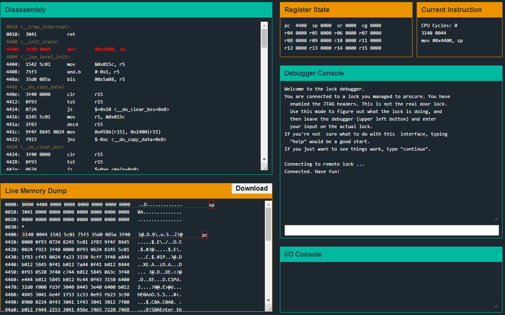

The embedded system architecture, assembly language, and many other details can be found in this manual:  
[Embedded System Manual](ti.com/lit/ug/slau049f/slau049f.pdf)

## Tutorial

We won't be doing a deep dive into the Tutorial exercise, but I'll give a highlight of how to navigate the debugger, test your input and solve an exercise. I do recommend doing the tutorial even if you're familiar with RE CTFs.

First is the <b>disassembly</b> window. This window colors the current instruction pointed to by the PC (Program Counter register) red. You can also set breakpoints by clicking on an instruction and ensuring a blue background is produced behind the instruction.

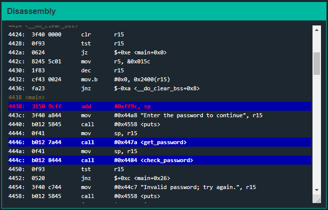

Below the disassembly window is the <b>live memory dump</b> window. This is where the stack/heap can be viewed. The byte surrounded by a red, dotted line illustrates the byte in memory a specific register is pointing to. In the below example, the sp (Stack Pointer) register is pointing to memory address 0x4000 and the pc register is pointing to memory address 0x4438. This can also be viewed in the register state window.
  
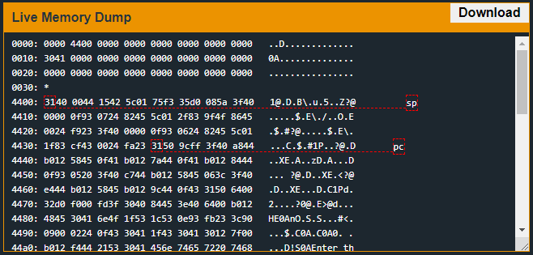

The first two windows on the right half of the debugger are the <b>register state</b> window and the <b>Current Instruction</b> window respectively. First the register state window displays all of the registers of the CPU and their current values. Note the SP register and the PC register match what is shown in the live memory dump window. Here is a quick description of what each of these register's functions are:

* PC (Program Counter) - This stores the value of the memory address of the currently execution instruction. These instructions are shown in red text in the disassembly window.
* SP (Stack Pointer) - This stores the value of the memory address of the current top of the stack. If any data is read or saved to memory, it will be saved at the address pointed to by this register.
* SR (Status Register) - This register stores bits that represent the status of the executing code. This is where the overflow, zero, carry bits and other information is stored for certain conditional instructions. For more detailed information view Table 3-1 in the embedded system manual linked above.
* CG (Constant Generator) - This register allows for a larget instruction set by using constant values to represent a shorthand for certain instructions. For more information, view section 3.2.4 of the embedded system manual linked above.
* R04 - R15 - These are general registers than can hold static values or memory addresses to refer to values in memory.

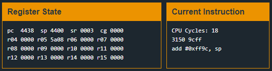

The middle window on the right side of the debugger is the <b>debugger console</b> window. This is where we can send debug level commands to interact with the execution of the instructions in the debugger. Below is an example of the help window of what commandss can be sent to the debugger and a short description of each. One command that is required to finish an exercise is the 'solve' command. The other commands are very similar to what you'll see in other debuggers.

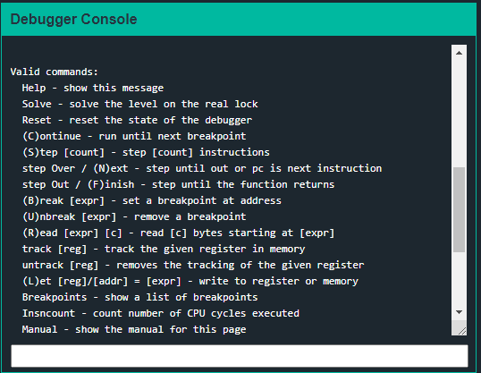

Finally, the last window on the right side of the debugger is the <b>I/O console</b> window. This window simply prints strings or other data into a console meant for the user to read, similar to stdout in a bash shell.

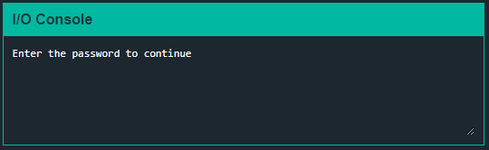

Once you have gone through the tutorial you can begin to work on exercises, for which writeups are written below.

## New Orleans

First, lets take a look at the main function to get a general idea of the flow of execution.

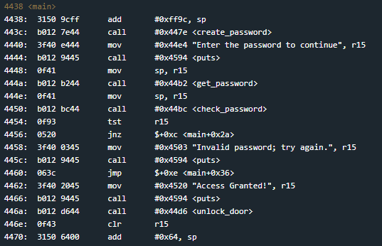

We see a few interesting function calls `create_password`, `get_password`, and `check_password`. Let's check what each one is doing.

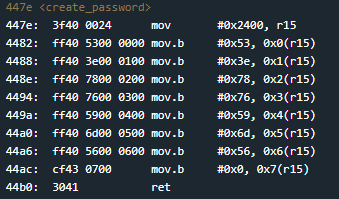

First we see the value `0x2400` moved into register `r15`. The next instruction shows the value `0x53` being moved `0x0` points (4 bits) offset from the memory address pointed to by the register `r15`. Just before the function returns, lets see what values were just moved into memory.

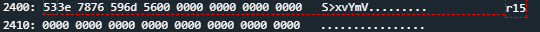  
*Note: use `track [reg]` in the debugger console to have the register highlight red in memory as shown above.*

We can see the values `533e 7876 596d 56` stored at address `0x2400`. When converted from hex to ascii we can see the string `S>xvYmV`, which is also shown in the live memory dump.

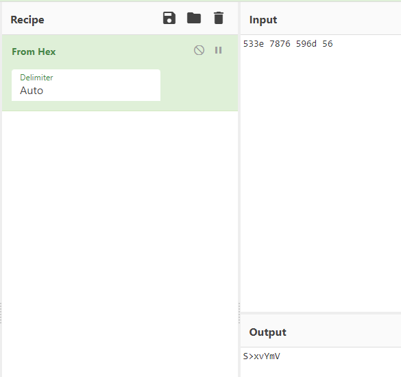  
*Note: Taken from [CyberChef](https://gchq.github.io/CyberChef/)*

Next let's check out the `get_password` function.

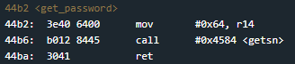

This function is pretty short, but calls another function `get_sn`. For simplicity I'll just say that this function prompts the user for their input and saves this input to memory address `0x439c`. In the below example I input "password" for testing purposes.

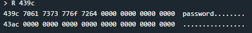

Finally let's inspect the `check_password` function, where the comparison between our input and the generated password in memory occurs.

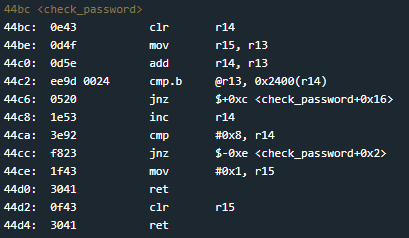

This function begins by moving the memory address storing our input into the register r13. The instruction at `0x44c2` is where the actual comparison occurs. The instruction `cmp.b` compares the bytes between the source and target. The source `@r13` represents a pointer to the address stored at the value in register r13. Because the value in r13 is 439c, we know this is pointing to our input string in memory. The target of the instruction, `0x2400(r14)`, takes the value in r14, currently `0x0000`, offset by 0x2400 points and set the memory address of the result as the target. So memory address `0x2400` is the target, where the generated password is stored.

The instruction at `0x44c6` checks if the byte of the source and target are the same. If not, jump to `<check_password+0x16>` which is the instruction at `0x44d2`. This means that if the bytes don't match, it clears register r15 and returns to main which then starts the branch of instructions that print "incorrect password".

So now that we know our input needs to match the string stored at memory address `0x2400`, let's try that as the password. To reset the debugger to how it was when we first opened the exercise type "reset" in the debugger console.

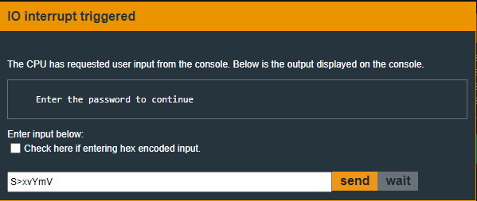

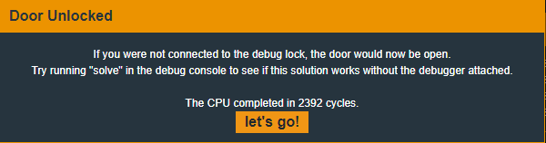

...And it works! Now to actually solve the exercise, we need to type "solve" into the debugger console and input the password we've found.

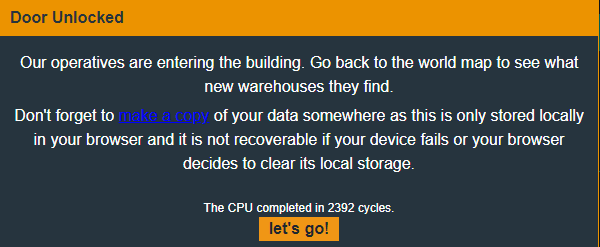

# Sydney
