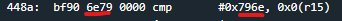
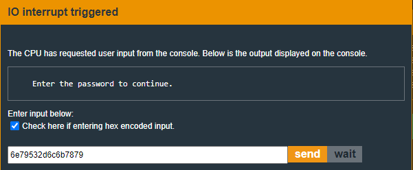
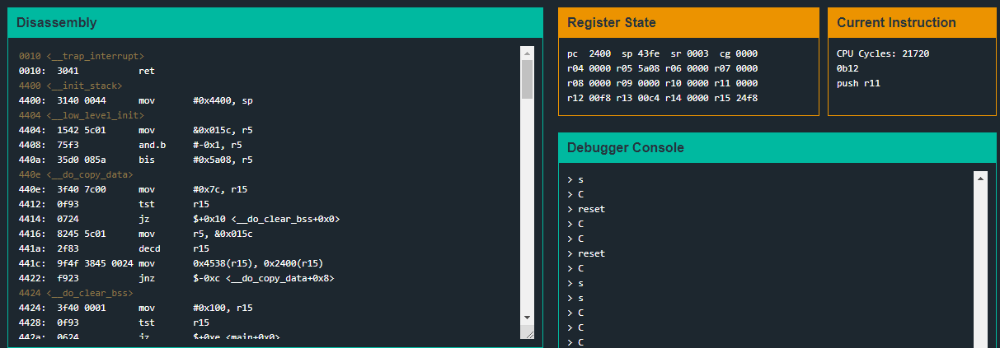
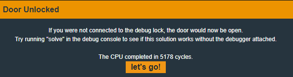

# [MicroCorruption](https://microcorruption.com/)

## Quick Navigation
* [New Orleans](#new-orleans)
* [Sydney](#sydney)
* [Hanoi](#hanoi)
* [Cusco](#cusco)
* [Reykjavik](#reykjavik)
* [Whitehorse](#whitehorse)
* [Montevideo](#montevideo)

## Overview

Microcorruption is an always online embedded systems, reverse engineering CTF. Each exercise presents an in-browser debugger. Your job is to find the password input to unlock the building that the embedded system controls.

The embedded system architecture, assembly language, and many other details can be found in this manual:  
[Embedded System Manual](ti.com/lit/ug/slau049f/slau049f.pdf)

A quick overview of the disassembler and fictional Lockitall LockIT Pro Manual:  
[Lockitall LockIT Pro Manual](https://microcorruption.com/public/manual.pdf)

## Tutorial

We won't be doing a deep dive into the Tutorial exercise, but I'll give a highlight of how to navigate the debugger, test your input and solve an exercise. I do recommend doing the tutorial even if you're familiar with RE CTFs.

First is the <b>disassembly</b> window. This window colors the current instruction pointed to by the PC (Program Counter register) red. You can also set breakpoints by clicking on an instruction and ensuring a blue background is produced behind the instruction.

Below the disassembly window is the <b>live memory dump</b> window. This is where the stack/heap can be viewed. The byte surrounded by a red, dotted line illustrates the byte in memory a specific register is pointing to. In the below example, the sp (Stack Pointer) register is pointing to memory address 0x4000 and the pc register is pointing to memory address 0x4438. This can also be viewed in the register state window.
  

The first two windows on the right half of the debugger are the <b>register state</b> window and the <b>Current Instruction</b> window respectively. First the register state window displays all of the registers of the CPU and their current values. Note the SP register and the PC register match what is shown in the live memory dump window. Here is a quick description of what each of these register's functions are:

* PC (Program Counter) - This stores the value of the memory address of the currently execution instruction. These instructions are shown in red text in the disassembly window.
* SP (Stack Pointer) - This stores the value of the memory address of the current top of the stack. If any data is read or saved to memory, it will be saved at the address pointed to by this register.
* SR (Status Register) - This register stores bits that represent the status of the executing code. This is where the overflow, zero, carry bits and other information is stored for certain conditional instructions. For more detailed information view Table 3-1 in the embedded system manual linked above.
* CG (Constant Generator) - This register allows for a larget instruction set by using constant values to represent a shorthand for certain instructions. For more information, view section 3.2.4 of the embedded system manual linked above.
* R04 - R15 - These are general registers than can hold static values or memory addresses to refer to values in memory.

The middle window on the right side of the debugger is the <b>debugger console</b> window. This is where we can send debug level commands to interact with the execution of the instructions in the debugger. Below is an example of the help window of what commandss can be sent to the debugger and a short description of each. One command that is required to finish an exercise is the 'solve' command. The other commands are very similar to what you'll see in other debuggers.

Finally, the last window on the right side of the debugger is the <b>I/O console</b> window. This window simply prints strings or other data into a console meant for the user to read, similar to stdout in a bash shell.

Once you have gone through the tutorial you can begin to work on exercises, for which writeups are written below.

## New Orleans

First, lets take a look at the main function to get a general idea of the flow of execution.

We see a few interesting function calls `create_password`, `get_password`, and `check_password`. Let's check what each one is doing.

First we see the value `0x2400` moved into register `r15`. The next instruction shows the value `0x53` being moved `0x0` points (4 bits) offset from the memory address pointed to by the register `r15`. Just before the function returns, lets see what values were just moved into memory.

  
*Note: use `track [reg]` in the debugger console to have the register highlight red in memory as shown above.*

We can see the values `533e 7876 596d 56` stored at address `0x2400`. When converted from hex to ascii we can see the string `S>xvYmV`, which is also shown in the live memory dump.

  
*Note: Taken from [CyberChef](https://gchq.github.io/CyberChef/)*

Next let's check out the `get_password` function.

This function is pretty short, but calls another function `get_sn`. For simplicity I'll just say that this function prompts the user for their input and saves this input to memory address `0x439c`. In the below example I input "password" for testing purposes.

Finally let's inspect the `check_password` function, where the comparison between our input and the generated password in memory occurs.

This function begins by moving the memory address storing our input into the register r13. The instruction at `0x44c2` is where the actual comparison occurs. The instruction `cmp.b` compares the bytes between the source and target. The source `@r13` represents a pointer to the address stored at the value in register r13. Because the value in r13 is 439c, we know this is pointing to our input string in memory. The target of the instruction, `0x2400(r14)`, takes the value in r14, currently `0x0000`, offset by 0x2400 points and set the memory address of the result as the target. So memory address `0x2400` is the target, where the generated password is stored.

The instruction at `0x44c6` checks if the byte of the source and target are the same. If not, jump to `<check_password+0x16>` which is the instruction at `0x44d2`. This means that if the bytes don't match, it clears register r15 and returns to main which then starts the branch of instructions that print "incorrect password".

So now that we know our input needs to match the string stored at memory address `0x2400`, let's try that as the password. To reset the debugger to how it was when we first opened the exercise type "reset" in the debugger console.

...And it works! Now to actually solve the exercise, we need to type "solve" into the debugger console and input the password we've found.

# Sydney

Below is the main function:

We see a few function calls, but the one of interest is `check_password`. Let's first enter our test input `password` to understand how our input is being compared to the actual password.

We can see our input is saved at address `0x439c`, stored in the sp register.

After we return from the `get_password` function, we see the value in sp moved to r15. Then the `check_password` function is called.

The commands are pretty straight forward. It is comparing static values against the values located at the memory address stored in r15, where our input is stored. If the 2 bytes compared of our input doesn't match the static bytes, the program counter will jump to address `0x44ac` which returns the value `0` in r15 and continues down the "incorrect password" branch of commands.

We could convert the hex values into ASCII characters and enter them that way, however we are given the option to enter our password as hex values.

Ensure you have checked the "Check here if entering hex encoded input" checkbox, enter the hex data and...

...It seems our guess was incorrect. So let's see what's going on.

We can see that r15 is pointing to the correct address in memory... and it matches the static values being compared. However, there is an explanation for what's going on here. If we look at the raw bytes that the pc register is pointing at for the cmp instruction, we'll see the static hex values are backward from what we expect:

So we see the data is read from memory from left to right, however the data is presented byte by byte from right to left. This is known as little endian data storage. So let's try entering the static hex values reading bytes from right to left.

Which gives us "Access Granted"! Next stop is Hanoi!

# Hanoi

Let's take a look at the main function.

It seems most of the functionality is in the login function, so let's look there.

We see generally the same functionality as in the previous exercises, however we now see a couple of arguments passed to `get_sn`, where our input is saved into memory. We see the value `0x1c` saved into `r14`, which will be the size of the buffer where our input is saved. We also see the value `0x2400` saved into register `r15`, representing the memory address our input will be saved in memory.

After our input is saved in memory at address `0x2400`, we see this value moved into `r15` and then the function `test_password_valid` called. This seems to be where our password is validated, so let's get more familiar with this function.

There seems to be a lot going on in this function, but I mainly want to focus on the 3 arguments passed to the INT function.

If we look at the Lockitall LockIT Pro [Manual](https://microcorruption.com/public/manual.pdf), specifically section 3.2, we see that passing the value `0x7d` to the interrupt function will test our input password against the password for the lock. However, this happens at the hardware level, and so we can't simply find the plaintext password in memory anymore. We'll have to get a bit more sophisticated if we want to complete this exercise.

If we look at section 4.3 in the manual for the interrupt listing and find list `INT 0x7d`, we'll see it takes two arguments. `The first argument is the password to test, the second is the location of a flag to overwrite if the password is correct.` So returning to our disassembly instructions, we see r15 passes the value for argument one and r14 passes the value for the second argument.

(NOTE: When identifying which arguments are passed first in assembly, each argument is passed in reverse order. In the above case, though we see r14 pushed to the stack first before calling the `INT` function, it would be the last argument in the arguments list passed. Hence why `0x7d` is pushed last, but is actually considered the first argument.)

Viewing the registers before the arguments are pushed to the stack we see `r14`, where the password verification flag is saved, is `0x43f8`. `r15` stores the value `0x2400`, where our password input is saved. Let's continue running through rest of the execution and see if we can identify a way to manipulate the code to allow us to unlock the door.

You may have noticed that after our input is tested against the saved password, the disassembler returns to the `login` function and does a check against the value `0xf` and the value at memory address `0x2410`, which is interestingly one 16 bytes from where our input is stored. Remember that the buffer storing our input was size `0x1c`? That should allow us to overwrite the value at the address to `0xf` to force it to evaluate to true and allow us to unlock the door.

So let's input 16 bytes of arbitrary hex data, then insert `0x0f` and see if we can unlock the door.

Note that the value `0x0f` is saved at memory address `0x2410`.

And we're in! Next stop is Cusco, Peru!

# Cusco

Before we jump into the disassembler, let's take a quick look at the manual and notice a few interesting comments for this version of the LockITPro lock.

It seems this is a direct iteration of the LockITPro device from the previous exercise, Hanoi.

Let's go ahead and take a look at the disassembly code now.

We see `main` just calls `login`, so let's take a look there.

This generally looks the same as the previous exercise (Hanoi), however we see an extra parameter sent to `getsn` in the `r14` register. The value `0x30` is stored in `r14`, which is the buffer size for our input. So now, no matter how long of a string we enter for the password, it will be cut off at 48 characters.

I entered our normal test input `password` and appended a bunch of characters to test this theory and it seems our input is stored between memory addresses `0x43ee` and `0x441d` with the string terminal null value (0x00) at `0x441e`. For the keen eye, you may notice these addresses cut into the addresses that store disassembly instructions.

...This may come in handy later. For now let's finish the execution of the disassembly code and look for opportunities to exploit this knowledge.

At instruction `0x4520` we see our input tested against the password stored in the device. The comparison is done at the hardware level (more information can be read in the Hanoi exercise write-up above or in the [Lockitall LockIT Pro Manual](https://microcorruption.com/public/manual.pdf)), so we can't just find the password comparison and enter that. We'll have to be a bit more clever to complete this exercise.

Notice after the password comparison is done, we are returned to the `login` function. If `r15` is zero, meaning our input did not match the password, we jump to the failure branch of execution, however there is an interesting run just before we return to the main function.

Interestingly the stack pointer, pointing at the beginning of our input in memory, gets incremented by `0x10`, which jumps right into the middle of our input at address `0x43fe`. And now the `pc` is pointing to the `retn` instruction at address `0x453e`.

To understand how the `retn` instruction works, let's take one more step in the disassembly and see what address is stored in the `pc` register.

We see `pc` is storing the value `6161`, or `aa` in ascii. So it's taking a portion of our password input pointed to by `sp`, reading it as a memory address, and pushing that to pc. Normally this would be the address of the function that called the function we are returning from, however the designer of this code didn't properly account for us inputting more than 16 characters and overwriting the address storing the calling functions address. So let's change our password to make sure we have the `sp` pointing to the address `0x4528` when `retn` is called.

(NOTE: Don't forget to account for the Little Endian memory storage method when entering your password input)

Notice we still go down the failure branch after the `tst r15` instruction. Just before `retn` is executed...

...Our `sp` register is pointing to our input `0x2845`, and when `retn` is executed...

...We are now on the success branch of the disassembly!

Another exercise down! Next to Reykjavik, Iceland!

# Reykjavik

Let's see what updates have been made to this version of LockITPro

No more easy exercises of reading the password in memory. Let's dive in to the disassembly and see what we can figure out.

We see a few values moved into `r14` and `r15`, then the function `enc` is called. `0xf8` is in `r14` and `0x2400` is in r15. These are the arguments passed to the function `enc`, so let's keep these in the back of our mind while we look at the `enc` function.

Between instructions `0x4490` and `0x449a` we see loop moving values between `0x00` and `0x100` into memory starting at address `0x247c`. Let's set a breakpoint after this loop and see what values are in memory.

After this loop, we see the address of the first value pushed in memory (`0x247c`) pushed into `r12`.

After this we see the values generated and stored at `0x247c` get sent through a decryption algorithm and saved to the same place in memory. This loop occurs between instructions `0x44a4` and `0x44d4`. Let's run through this loop and see what gets written in memory.

Hmm, doesn't look like much right now but let's keep going through the disassembly and this should start becoming more clear. Continuing the disassembly execution we see one last loop in the `enc` function between `0x44dc` and `0x450e`. This is taking the data generated in loop 2, performing some bitwise operations and stores the result at memory address `0x2400` (the argument stored in `r15`). Let's set another breakpoint past this loop and see what data is stored at memory address `0x2400`.

...Well it still doesn't look like much, however let the disassembly run and return to the `main` function and notice the next instruction.

It seems to think there is a function to call at memory address `0x2400`. Now this is starting to become a bit more clear. So far the assembly code has dynamically generated more assembly code through the `enc` function and is now calling that code. However, once you step into the function call, the disassembler becomes useless.

The disassembler is only displaying instructions at memory address `0x10` (the hardware interface) and above address `0x4000`. However, our `pc` is at memory address `0x2400`. We can see there are valid instructions in the `current instruction` window, but it would be nice to see the flow of instructions in one place akin to the disassembler. Luckily the developers have given us just this capability. Open the [(dis)assembler](https://microcorruption.com/assembler) window and paste the data from the `Live Memory Dump` window (between the addresses `0x2400` and ~`0x2500`) into the text box, then click disassemble.

And now we have a much better view of the instruction flow. Let's start working through these new instructions.

We see a few values set in `r4` and `r11`, then a `jmp` command. Let's step through the instructions until we execute the jmp instruction.

Our `pc` has jumped to address `0x2420`, which is instruction `mov.b @r11, r15`. Find this in our disassembly and continue following the execution.

We see the program check if a value is at the memory address pointed to by `r11`, memory address `0x4520`. This memory address holds the string `what's the password`? If there is a value here, we eventually call the function at memory address `0x2464`. Let's continue execution to see what this function does.

We see `what's the password` printed to our console...

Let's take a step back and see if we can understand what's happening here. Find the code that is stored at memory address `0x2464` and correlate that with our disassembly. We can see a familiar set of instructions.

If we keep track of what values are being passed to this function in `r14`(0x00) and `r15`(0x77 or w in ascii), we can see that putchar is being called in the first call to `0x2464`.

(NOTE: If this doesn't make sense, refer to the [Lockitall LockIT Pro Manual](https://microcorruption.com/public/manual.pdf). Specifically section 4.3)

Once the string `what's the password?` is printed to the console, we see `0x2464` called a second time, passing the values `0x0` (meaning put) and `0xa`. This doesn't seem to do anything that I can tell. Moving to the third call of `0x2464` it is executing the `get` function by passing the value of the memory address our input is stored and the hex value `0x2`.

Let's use our test input `password`, see where in memory it's saved and see how we can get the door unlocked to finish the exercise.

We can see our input stored at memory address `0x43da`. But we see an intersting instruction just after we return from the function that takes our input.

There is a simple `cmp` instruction that will send us down the success branch to unlock the door. We just need to make sure the address pointed to by `r4` subtracted by 24 bytes is the hex value `0xc01c`. If we read what is stored at the memory address...

...Surprise, surprise. I think the solution seems pretty clear now.

Next stop is Whitehorse, Canada!

# Whitehorse

Time for another exciting MicroCorruption exercise. First note this a new 'category' (hardware version) from the previous exercises, so expect this to require a different approach.

As always let's get an understanding of the behavior of this program. First let's look at the `main` function.

It just calls the `login` function, so let's take a look there.

Nothing too new here, we see strings being printed to the console, our input being saved with the `getsn` function. The only new function is `conditional_unlock_door`, let's jump to executing there to find where our input is saved in memory and figure out how the program is handling our input.

We can see our input saved at memory address `0x3812`.

Within the `conditional_unlock_door` function we see our input and the value `0x7e` passed to the software interrupt function `INT`. Nothing interesting happening here, so let's allow the program to return to the `login` function and see if we can find anything interesting.

Since our input was incorrect, we'll jump to the failure branch of the program at address `0x451a`, however this seems pretty familiar to a previous exercise? We know the buffer for our input is `0x30` bytes:

...and the instruction at `0x452a` we see the stack pointer `sp` incremented to an address we can overflow into.

Let's try the same trick as the previous exercise and see if we can force the program to execute the success branch at address `0x451c`.

We have the correct address to `retn`, however...

...We only print the string `Access Granted`, but we don't actually unlock the door. So what is going on?

Well, it seems the security updates for this version of the lock have been effective. Let's think about what we can do with what we know now. We can have the code return to an arbitrary address in the code, however nothing that exists in the code as it is can really help us. It is possible to add a bit of code within the buffer allocated by the program. We can't arbitrarily change data in the registers. Somehow we have to force the software interrupt to unlock the lock for us.

The solution requires a bit of digging into the [Lockitall LockIT Pro Manual](https://microcorruption.com/public/manual.pdf)

This is an interesting bit of information. We need to figure out a way to send the argument `0x7f` to the software interrupt function. This is possible using the byte commands used by the program already.

So to solve this exercise, we need to enter the byte commands to push `0x7f` to the stack, call the `INT` (software interrupt) function and exploit the `retn` command to force the program to execute these commands. Using the [(dis)assembler](https://microcorruption.com/assembler) we can test that our commands are doing what we intend.

Finally, let's put it into the program as our input and follow the execution after the `retn` command.

We can see the `sp` register is pointing to our input to start executing our instructions at address `0x38a1`

Now the `pc` register is pointing in memory to our byte commands to execute the software interrupt.

...And if we continue execution...

Solved!

Next stop is Montevideo, Uruguay!

# Montevideo
